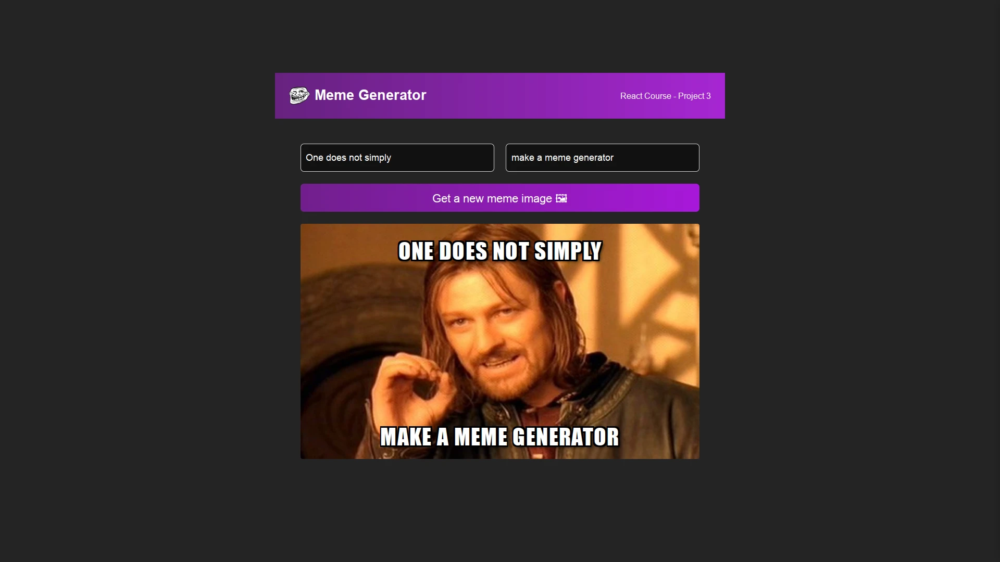

# Meme-Generator

## Description

Create hilarious memes with this easy-to-use React app!

## Technologies Used

- Vite
- .jsx
- JavaScript (ES6)
- CSS3
- React

## Links

- [Deployed Site](https://memegen-bydainelli.netlify.app)

## What was done

- Created a meme generator using React.
- Created an API call that fetches a new random image from the Imgflip API.
- Created a form that allows the user to input their own text for the top and bottom of the meme.
- Created a button that generates a new meme with the user's inputted text.

## What I learned

- useState
- useEffect
- Forms in React

## To do list

- Saving memes as images (.jpeg, .png, etc...)
- Sharing on Social Media
